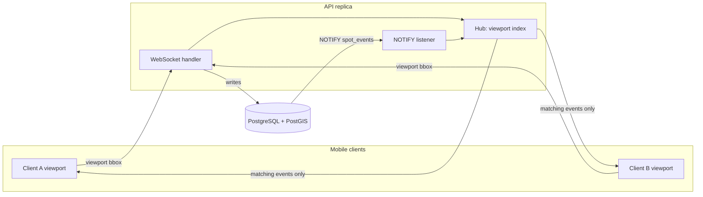
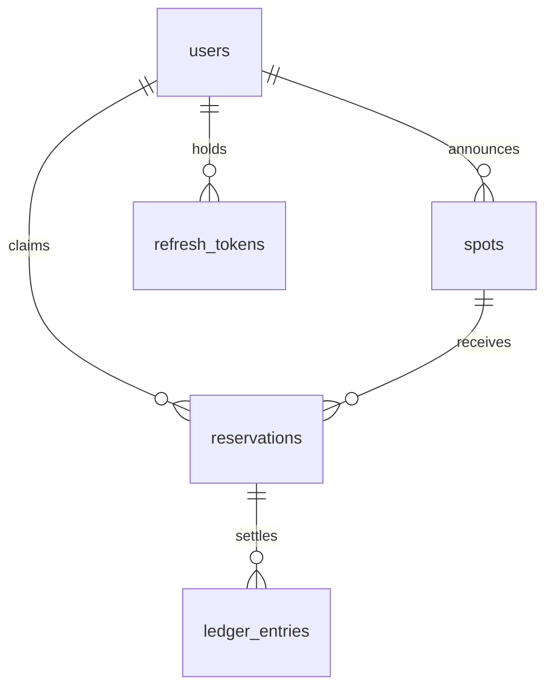
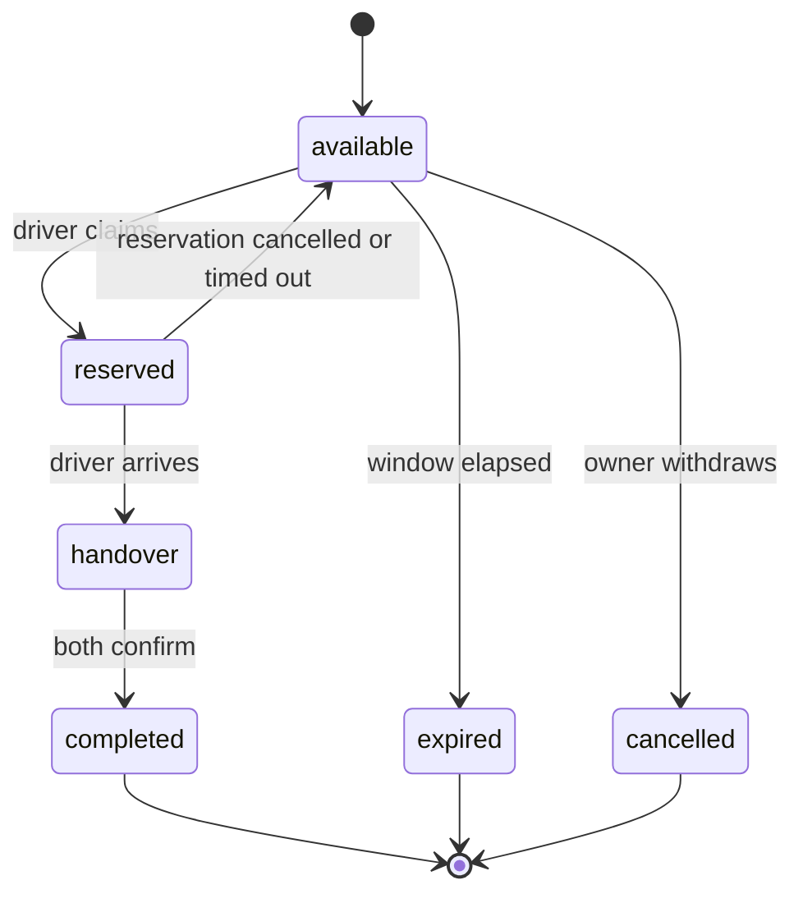

# ParkXchange — Architecture

ParkXchange is a peer-to-peer marketplace for on-street parking. A driver who is
about to vacate a public parking space announces it; a driver looking for one
sees it appear on a map in real time, claims it, navigates to it, and the two
complete a handover. The person giving up the space receives a small
compensation.

The product is therefore three hard problems wearing a trench coat:

1. **A geospatial query problem.** "What is available inside the rectangle I am
   currently looking at?" must stay fast as the dataset grows.
2. **A real-time fan-out problem.** A space is worth announcing only for the few
   minutes before someone takes it, so staleness is fatal. Clients must be
   pushed changes, not poll for them.
3. **A contention problem.** Two drivers will race for the same space. Exactly
   one may win, always.

Every decision below is in service of one of those three.

---

> **Before writing code in `services/api`, read §2.2.** The layering is
> enforced by `services/api/internal/arch/arch_test.go`, which fails the build
> when a dependency points the wrong way. `AGENTS.md` is the short version.

## 1. Stack

| Concern | Choice | Version pinned at bootstrap |
| --- | --- | --- |
| Monorepo orchestration | Task (`Taskfile.yml`) | 3.53.1 |
| JS/TS task graph & cache | Turborepo | 2.10.12 |
| JS/TS package manager | pnpm workspaces + catalogs | 11.1.2 |
| Backend language | Go, `net/http` + `ServeMux` | 1.26.3 |
| Go multi-module overlay | `go.work` | — |
| WebSockets | `github.com/coder/websocket` | see `services/api/go.mod` |
| Database | PostgreSQL + PostGIS | see `docker-compose.yml` |
| DB driver | `pgx/v5` | see `services/api/go.mod` |
| Migrations | `goose`, embedded via `embed.FS` | see `services/api/go.mod` |
| Mobile framework | Expo (prebuild + dev client) | SDK 57 / React Native 0.86 |
| Maps | `@maplibre/maplibre-react-native` | v11 |
| Language (frontend) | TypeScript | 5.9.3 |
| Node runtime | Node.js LTS | 24.19.0 |

Two notes on versions that look wrong but are not:

- **TypeScript is 5.9.3, not 7.x.** TypeScript 7 is released, but the React
  Native and Expo toolchains still target the 5.x line. We follow Expo's
  supported version and will move when Expo does.
- **Node is 24 LTS, not 22.** The plan called for Node 22; the current LTS line
  is 24.19.0, which satisfies Expo SDK 57's `>= 22.13` floor and has a longer
  support window. There was no reason to install an older LTS.

---

## 2. Repository layout

```
ParkXchange/
├── Taskfile.yml              # the only entry point: setup, doctor, test, lint
├── Taskfile.db.yml           # db:up, db:migrate, db:seed, db:psql, db:reset
├── Taskfile.go.yml           # api:run, api:test, api:lint, api:build
├── Taskfile.mobile.yml       # mobile:android:{emulator,device}, mobile:start, …
├── go.work                   # local Go overlay (gitignored, see §3.1)
├── pnpm-workspace.yaml       # JS workspace members + version catalog
├── turbo.json                # JS task graph and cache contracts
├── docker-compose.yml        # PostGIS (+ API) for local development
├── ARCHITECTURE.md           # this file
├── PROGRESS.md               # cross-session state; see §10
├── services/
│   └── api/                  # Go module: the whole backend
│       ├── cmd/api/          # composition root: wires ports to adapters
│       ├── cmd/migrate/      # migration and seed CLI
│       ├── internal/         # non-importable; layered, see §2.2
│       │   ├── domain/       # entities, state machines, rules, error kinds
│       │   ├── accounts/     # use cases + ports for identity
│       │   ├── spots/        # use cases + ports for parking spots
│       │   ├── reservations/ # use cases + ports for claims, deposits, sweep
│       │   ├── postgres/     # PostGIS adapter: the only SQL in the repo
│       │   ├── api/          # HTTP adapter: handlers, routing, middleware
│       │   ├── realtime/     # in-memory hub: viewport match, bounded send
│       │   ├── web/          # HTTP plumbing: error envelope, status mapping
│       │   ├── auth/         # crypto adapter: argon2id, JWT, refresh tokens
│       │   └── arch/         # the test that enforces all of the above
│       └── migrations/       # SQL migrations, embedded into the binary
├── libs/
│   └── go/geo/               # Go module: bbox, GeoJSON, coordinate fuzzing
├── apps/
│   ├── mobile/               # Expo application
│   └── web/                  # Static marketing site (GitHub Pages)
├── packages/
│   ├── api-contract/         # OpenAPI spec + generated TypeScript types
│   └── tsconfig/             # shared TypeScript configurations
├── infra/pulumi/             # deployment target, out of MVP scope
└── tools/                    # repo scripts (doctor, etc.)
```

### 2.1 Why two ecosystems with a hard boundary

Go and TypeScript are managed by their own native tooling and never by each
other's:

- **`go.work`** provides the local editing overlay across the two Go modules.
- **pnpm workspaces + Turborepo** own the JS/TS graph, caching and catalogs.
- **Task** is the single human-facing entry point; it delegates to `go` or to
  `pnpm turbo` and never reimplements either graph.

The rule this protects: `turbo` never invokes Go, and Task never duplicates what
pnpm already knows. A Go-only CI lane installs Go and nothing else — no Node
runtime warm-up for a job that only runs `go test`.

---

### 2.2 Layering inside the Go service: pragmatic ports and adapters

**This is enforced by a test.** `services/api/internal/arch/arch_test.go` reads
every import in the service and fails the build if a dependency points the wrong
way. Its failure messages name the rule that was broken and what to do instead.
The rules map in that file is the specification; this section explains why it
says what it says. A package with no rule declared fails too, so a new package
cannot quietly land outside the architecture.

Dependencies point inwards:

```
        libs/go/geo  (pure: bbox, GeoJSON, coordinate fuzzing)
              |
           domain          entities, state machines, validation, error kinds
              |
    accounts, spots, reservations   use cases; each declares the ports it needs
              |
  postgres, api, web, auth adapters; they implement ports
              |
           cmd/api         the only place that connects the two
```

| Layer | Packages | May depend on | Never depends on |
| --- | --- | --- | --- |
| Domain | `internal/domain` | `libs/go/geo` | `pgx`, `net/http`, adapters |
| Use cases | `internal/accounts`, `internal/spots`, `internal/reservations` | `internal/domain` | any adapter, `net/http` |
| Adapters | `internal/postgres`, `internal/api`, `internal/realtime`, `internal/web`, `internal/auth` | the domain, and the ports they implement | each other |
| Composition root | `cmd/api` | everything | — |

Four properties follow, and they are the reason for the arrangement:

- **Business rules are reachable without HTTP.** Phase 6 adds a goroutine that
  sweeps expired reservations, and Phase 7 adds a WebSocket hub. Both must apply
  the same rules as the REST handlers. With the rules inside `net/http`
  handlers, the only options would have been duplicating them or having a
  background worker call HTTP-shaped code.
- **Rules are tested in milliseconds.** `internal/domain` and the service
  packages have no I/O, so the bulk of the coverage runs without Docker.
- **Ports are shaped like use cases, not like tables.** There is no `Save` and
  no `FindAll`. `CancelSpot(ctx, spotID, ownerID)` exists as a single method
  because the operation has to be one conditional write; a generic `Save` would
  let an implementation satisfy the signature while losing the atomicity, which
  is the entire guarantee.
- **Ports are declared by the consumer.** `accounts.Store` and `spots.Store`
  live in the packages that call them, not in `internal/postgres`. The adapter
  imports the use case packages to assert it still satisfies them
  (`postgres/ports.go`), so a signature change fails against the method that is
  wrong rather than against the wiring in `cmd/api`.

### 2.3 Why this is not strict hexagonal, deliberately

Full ports-and-adapters would put a repository interface in front of everything,
with an in-memory implementation for tests. That was considered and rejected,
because **the guarantees this product depends on are database guarantees, not Go
guarantees**:

- the viewport search is `geom && ST_MakeEnvelope(...)` answered by a partial
  GiST index (§3.2);
- claiming a spot is one conditional `UPDATE ... WHERE status='available'`
  (§3.6);
- "at most one active reservation per spot" is a partial unique index;
- the ledger is append-only by trigger;
- real-time delivery is `LISTEN/NOTIFY` (§3.4).

An in-memory `spots.Store` cannot honour any of those without reimplementing a
database. It would be a port with exactly one possible implementation whose
semantics leak SQL anyway, and worse, tests against the double would pass while
production broke, because the double cannot reproduce concurrency. Strict
hexagonal would also have forced either optimistic locking with a `version`
column and retry loops, or a Unit of Work port whose parameter is a bundle of
other ports, to get the atomicity that one `UPDATE` already provides.

So the boundary is drawn where it pays and not where it does not:

- **Abstracted**, because a second implementation is real or the seam makes
  tests possible: the `Store` ports, `accounts.Hasher` (argon2id costs 64 MiB
  per call, so tests substitute a cheap one), and — when Phase 7 lands — the
  event bus, which `ARCHITECTURE.md` §3.4 already documents as moving off
  `LISTEN/NOTIFY` when fan-out outgrows it.
- **Concrete**, because there is no plausible alternative and pretending
  otherwise costs correctness: PostGIS itself. `internal/postgres` is named
  after its technology on purpose.

The honest summary: the domain here is thin (a state machine and a price) and
the persistence is where the difficulty lives. Hexagonal architecture pays when
that relationship is inverted. Optimising for replacing PostgreSQL would have
bought insurance against something that is not going to happen, while the real
risks — concurrency, spatial query performance, WebSocket fan-out — are ones no
port protects against.

### 2.4 Error handling across the boundary

A use case never returns an HTTP status. It returns a `*domain.Error` carrying a
`domain.Kind`, plus a stable machine-readable `Code`, a human `Message` and
optional per-field `Fields`. `internal/web` owns the single mapping from kind to
status (`web/errors.go`), so a handler can return a service error unchanged and
still produce the uniform envelope of §5.2.

`KindInternal` is the zero value on purpose: an error nobody classified is a bug,
and defaulting to 500 means it gets alerted on instead of being reported to the
user as their own mistake. Adapters report plumbing conditions with the sentinels
in `domain` — `ErrNoRows`, `ErrDuplicate`, `ErrConflict`, `ErrTokenReused`,
`ErrTokenExpired` — and the use case decides what each one means, because whether
a missing row is a 404 or a deliberately vague 401 is a product decision that an
adapter has no business making.

## 3. Design decisions

### 3.1 `go.work` is gitignored, and CI runs with `GOWORK=off`

A workspace overlay resolves every local import even when a module forgot to
declare a requirement in its own `go.mod`. That is convenient locally and a
time bomb in a release build. `go.work` is therefore generated on demand by
`task go:init` and never committed, and CI builds each module with `GOWORK=off`
so a missing requirement fails the build instead of the deploy.

### 3.2 Geometry, not geography, for stored points

Spots are stored as `geometry(Point, 4326)` with a GiST index, not as
`geography`.

The hot path of the entire product is "give me the spots inside the rectangle on
screen". That is exactly what the `&&` bounding-box operator answers using the
index:

```sql
SELECT ... FROM spots
WHERE status = 'available'
  AND expires_at > now()
  AND geom && ST_MakeEnvelope($1, $2, $3, $4, 4326);
```

`geography` would make metre-accurate distance the default at the cost of making
the common case slower and the index less useful. We need the opposite trade:
bounding-box filtering is constant and hot, distance is occasional and cold. The
few "120 m away" labels are computed with a per-row cast to `geography`, which
is cheap once the index has already reduced the candidate set.

### 3.3 The API speaks GeoJSON

`GET /v1/spots?bbox=...` returns a GeoJSON `FeatureCollection`, not a bespoke
JSON array.

MapLibre consumes that document directly:

```tsx
<GeoJSONSource id="spots" data={featureCollection} cluster clusterRadius={48}>
  <Layer id="spots-circles" type="circle" paint={{ "circle-radius": 8 }} />
</GeoJSONSource>
```

There is no adapter layer, no second representation of a point, and clustering
comes free from the source. The cost is a slightly more verbose wire format,
which gzip makes irrelevant.

### 3.4 Real-time: in-memory hub with viewport subscriptions, `LISTEN/NOTIFY` as the bus

Every WebSocket connection registers the bounding box it is currently looking
at. When a spot changes, the hub fans the event out **only** to connections
whose viewport contains that point.



Why `LISTEN/NOTIFY` rather than Redis or NATS: the database is already a
required, already-deployed, already-transactional component. Publishing the
event in the same transaction that changed the row removes the
"committed-but-never-announced" failure mode for free. Adding a broker to the
MVP would buy throughput we do not yet need and cost an extra thing to operate.

Two constraints this imposes, both handled explicitly:

- **`NOTIFY` payloads are capped at 8000 bytes.** We publish only what routing
  needs (event type, spot id, longitude, latitude, status, price), never the
  full entity.
- **Fan-out is O(connections) per event.** Acceptable at MVP scale. The
  documented upgrade path is to index subscriptions by tile key (quadkey at a
  fixed zoom) so an event only touches the connections watching that tile, and
  to move the bus to NATS when a single Postgres connection per replica becomes
  the bottleneck.

### 3.5 `coder/websocket`, not `gorilla/websocket`

`gorilla/websocket` is archived and **panics if two goroutines write to the same
connection** — which is precisely the shape of a fan-out hub. `coder/websocket`
is maintained, takes a `context.Context` everywhere, and serialises concurrent
writes internally. Choosing the archived library would mean hand-rolling a
per-connection writer goroutine just to avoid a panic.

We still use a bounded per-connection send channel, for a different reason: back
pressure. A phone on a bad connection must not be allowed to grow an unbounded
queue in the server. When a client's buffer is full it gets disconnected and is
expected to reconnect and re-subscribe, which is cheaper and more correct than
buffering forever.

### 3.6 Claiming a spot is one conditional `UPDATE`

Never `SELECT` then `UPDATE`. The only way to claim a spot is:

```sql
UPDATE spots
   SET status = 'reserved', updated_at = now()
 WHERE id = $1 AND status = 'available'
```

If that affects zero rows, somebody else won and the caller gets `409 Conflict`.
Combined with a partial unique index that permits at most one active reservation
per spot, double booking is impossible without advisory locks, `SERIALIZABLE`
retries, or application-level coordination. This is verified by a test that
fires a hundred concurrent claims at one spot and asserts exactly one winner.

### 3.7 Exact coordinates are withheld until a spot is reserved

While a spot is `available`, the API returns coordinates rounded to roughly 30 m.
Exact coordinates are released only to the driver holding a confirmed
reservation.

This is a product decision with a one-line implementation in the serialiser, and
it is far cheaper to make now than to retrofit. Publishing precise, live
"this person is leaving their home parking space right now" coordinates to every
anonymous client is a stalking vector, and it also removes the incentive to
scrape the map instead of using the app.

### 3.8 The OpenAPI document is the source of truth for types

`packages/api-contract/openapi.yaml` generates:

- Go request/response types (`oapi-codegen -generate types`)
- TypeScript types (`openapi-typescript`)

Handlers stay hand-written on `net/http` and `ServeMux`; we generate **types,
not servers**, because the routing rules are the part worth reading and owning.
What we refuse to own is two hand-maintained copies of the same payload shape in
two languages, which drift silently and are discovered by a user.

### 3.9 Bounding boxes are always validated

An unvalidated `bbox` is a denial-of-service endpoint: a client asks for the
whole planet and the database obliges. Every request is checked for a
well-formed, non-degenerate box, a maximum spanned area, a minimum zoom, and a
hard cap on returned features.

### 3.10 MapLibre React Native v11 conventions

v11 (April 2026) dropped the legacy architecture and renamed its API to track
MapLibre GL JS. All frontend code targets the new names from the start:

| Legacy (v10, in most tutorials) | v11 |
| --- | --- |
| `<MapView>` | `<Map>` |
| `centerCoordinate`, `zoomLevel`, `heading` | `center`, `zoom`, `bearing` |
| `<ShapeSource shape={...}>` | `<GeoJSONSource data={...}>` |
| `<CircleLayer>`, `<SymbolLayer>`, … | `<Layer type="circle" \| "symbol" …>` |
| `style={{ fillColor }}` | `paint={{ "fill-color" }}` |
| `<PointAnnotation coordinate>` | `<ViewAnnotation lngLat>` |
| `getVisibleBounds()` | `getBounds()` |
| `followUserLocation` | `trackUserLocation` |
| event payload on the event | event payload on `event.nativeEvent` |

The library cannot run in Expo Go because it ships native code, so the mobile
workflow is `expo prebuild` plus a dev client, not Expo Go.

### 3.11 PMTiles are read directly from object storage

MapLibre Native supports the `pmtiles://` scheme (Android >= 11.7.0,
iOS >= 6.10.0) using HTTP range requests, so a basemap can be served as a single
file from S3 with no tile server in front of it. The URL inside the scheme must
be fully qualified: `pmtiles://https://bucket.s3.amazonaws.com/basemap.pmtiles`.

Development uses MapLibre's public demo tiles. Because the style URL is injected
through `EXPO_PUBLIC_MAP_STYLE_URL`, switching to S3 is a configuration change
rather than a code change.

### 3.11a Map search uses LocationIQ (not public Nominatim)

Place search, autocomplete, reverse geocode and category Nearby go through
**LocationIQ** (`eu1`, Free tier by default) via `EXPO_PUBLIC_LOCATIONIQ_KEY`.
Name search order: Autocomplete → Search → **Photon** (only if both returned
nothing — typo / fuzzy last resort). Set `EXPO_PUBLIC_PHOTON_ENABLED=0` to
disable Photon if the public demo rate-limits you. There is no cheaper managed
fuzzy alternative for MVP; client brand aliases also reduce typos before any
API call. Self-host Photon later if you need fuzzy at scale.

- street + house number → structured / free-form search
- exact category term (locale lexicon) → Nearby POI by OSM tag
- otherwise → Autocomplete → Search → Photon

Results are sorted near→far from the map viewport centre. Debounced
autocomplete and an in-app category action row avoid burning the Free quota.
Attribution: show “Search by LocationIQ.com” on Free commercial use.

**Capacity (order of magnitude, with debounce + cache):** Free ~5k req/day ≈
1.5–2.5k active users/day; Developer ~$100/mo ≈ 8–12k; Startup ~$200/mo ≈
20–30k. Self-host Nominatim+Photon for Spain on Hetzner is a later option
(~25–45 €/mo + ops) when paid LocationIQ hurts — see
`docs/superpowers/plans/2026-09-21-geocode-locationiq-early-phase.md`.

### 3.12 Navigation is delegated, never reimplemented

Turn-by-turn navigation is a solved problem owned by apps the user already
trusts and has configured. ParkXchange hands off through deep links —
`google.navigation:q=…` for Google Maps, `waze://?ll=…&navigate=yes` for Waze,
`maps://?daddr=…` for Apple Maps — probing availability with `canOpenURL` and
falling back to a web URL. Android requires the target schemes to be declared in
the manifest's `queries` element for `canOpenURL` to report the truth.

### 3.13 Advance booking, and the two mechanisms that make it survivable

A driver may announce that they are leaving at a specific future moment, up to
24 hours ahead, and another driver may claim that spot before the moment
arrives. A claimed spot leaves the map immediately, which is the point: it stops
a third driver turning up for a space that is already promised.

Those two properties together create the problem this section exists to solve.
One click can remove a spot from the market for a day, and the two sides of the
deal are not equally committed. The announcer is physically committed — they are
in the space, and they wait to hand it over instead of leaving when it suits
them. The claimer committed a tap. Without a counterweight, claiming early is a
free option: if the plan changes, walking away costs nothing, the space returns
to the map at a moment when nobody is looking, and the announcer waits for
somebody who was never coming.

Two mechanisms carry the weight, and each fixes a different half:

- **A deposit.** Claiming writes a `hold` (negative) against the driver's
  virtual balance. Completing the handover leaves that hold in place — it is
  the payment — and writes a matching `credit` to the owner. A fair cancel
  before `starts_at` writes a `release` that unwinds the hold. A forfeit
  (missed reconfirm, or cancelling after the window opens) leaves the hold and
  credits the owner. New accounts receive a `credit` of 10 points on
  registration, otherwise nobody could ever make their first claim. Hoarding is
  self-limiting: every live claim ties up its own deposit.
- **A reconfirmation.** A reservation made well before the handover starts as
  `pending` and must be reconfirmed shortly before `starts_at` to become
  `confirmed`. If the driver does not, the sweeper releases it and the spot
  returns to the map with enough lead time for somebody else to use it. This
  converts a promise made 24 hours out, which humans break routinely, into one
  made 15 minutes out, which they mostly keep.

Three details that are easy to get wrong:

- **Reconfirmation is skipped when there is nothing to reconfirm.** A spot
  available right now, claimed by a driver three minutes away, gains nothing
  from a handshake; the reservation is born `confirmed`. The rule triggers only
  when `starts_at` is further away than the reconfirmation window, so the
  present-moment flow carries no added friction.
- **The penalty is two-sided.** An owner who withdraws an already-claimed spot
  releases the driver's deposit and is debited themselves. Charging only the
  driver would hand the owner the same free option the deposit exists to remove.
- **The statuses already existed.** `pending → confirmed → arrived →
  completed`, defined in phase 2, maps exactly onto claim → reconfirm → arrive
  → hand over. No new state was needed.

Two structural consequences:

- **"One active reservation per driver" was replaced, not removed.** That
  partial unique index was correct while every claim was for the present
  moment, but it forbids something legitimate once claims are dated: tonight at
  18:30 and tomorrow at 09:00 do not conflict. Dropping it outright would bring
  back the hoarding it prevented, so it became an exclusion constraint
  forbidding *overlapping* claims per driver:
  `EXCLUDE USING GIST (driver_id WITH =, tstzrange(starts_at, ends_at) WITH &&)`.
  A driver cannot be in two places at once, and that is the only thing worth
  forbidding structurally. It needs `btree_gist`, because core GiST has no
  operator class for `uuid` equality.
- **The reservation carries its own copy of the window.** `starts_at` and
  `ends_at` are denormalised from the spot for the same reason `price_cents`
  already was: the row is the record of what was agreed, and a later edit of
  the spot must not rewrite history. It is also a precondition for the
  constraint above, since a constraint cannot reach into another table.

The spatial index is untouched by any of this. Its predicate is
`WHERE status = 'available'`, purely status-based, so the discovery query's new
time-range filter applies to rows the index has already returned. Advance
booking costs the hot path nothing structural. If the time filter ever becomes
the bottleneck, `btree_gist` is now available and
`GIST (geom, tstzrange(available_from, expires_at))` is the answer — but
building it before there is evidence would be guessing.

**The lead-time cap is a `CHECK` against `created_at`, not `now()`.** A `CHECK`
may only reference its own row, and `now()` is not immutable; comparing two
columns is. It also puts the cap where it belongs, on the moment the promise was
made rather than on every subsequent read of the row.

**Reconfirmation implies push notifications.** A handshake the user cannot be
told about is a handshake that always fails, so `expo-notifications` moves into
scope with the reservation flows. This is the one place where the temporal scope
genuinely enlarged the MVP rather than rearranging it.

---

## 4. Data model



- **`users`** — credentials hashed with argon2id, display name, rating, virtual
  balance in cents.
- **`spots`** — owner, `geom geometry(Point,4326)`, size class, status, price,
  availability window. The window may start in the future, capped at 24 hours
  ahead by a `CHECK` against `created_at` (§3.13). Partial GiST index on `geom`
  where the status is `available`, plus a partial btree on
  `(available_from, expires_at)` for the time-range filter and the sweeper.
- **`reservations`** — spot, driver, status, the claimed window (`starts_at`,
  `ends_at`, denormalised from the spot as the historical record), the
  reconfirmation deadline and the price agreed at claim time. A partial unique
  index forbids more than one active reservation per spot; an exclusion
  constraint forbids a driver holding two claims that overlap in time.
- **`ledger_entries`** — append-only virtual balance movements (`hold`,
  `release`, `credit`, `debit`), made append-only by trigger rather than by
  convention. A `hold` is the deposit behind a claim and a `release` returns it,
  which is what makes advance booking cost something (§3.13). The MVP settles
  no real money, so there is no payment gateway; the ledger exists so that
  adding one later is an integration, not a redesign. `user_balances` is a view
  summing the entries, so there is exactly one definition of a balance and no
  denormalised column to drift from the rows that justify it.
- **`refresh_tokens`** — rotating refresh tokens with revocation.

The spot lifecycle is enforced in SQL through `CHECK` constraints and the
conditional updates of §3.6, not only in Go:



---

## 5. API surface

```
POST   /v1/auth/register
POST   /v1/auth/login
POST   /v1/auth/refresh
GET    /v1/me

GET    /v1/spots?bbox=minLon,minLat,maxLon,maxLat&zoom=&from=&to=
                                                          -> FeatureCollection
POST   /v1/spots
DELETE /v1/spots/{id}

POST   /v1/spots/{id}/reservations                        -> atomic claim
GET    /v1/reservations/active
GET    /v1/reservations/{id}
POST   /v1/reservations/{id}/reconfirm
POST   /v1/reservations/{id}/cancel
POST   /v1/reservations/{id}/complete

GET    /v1/ws                                             -> WebSocket upgrade
POST   /v1/ws/tickets                                     -> short-lived handshake ticket
GET    /v1/version
GET    /healthz
GET    /readyz
```

`/healthz` answers as long as the process is alive; `/readyz` also requires a
usable database connection. That distinction is what lets Kubernetes restart a
wedged pod without taking a healthy one out of rotation during a database blip.

### 5.2 One error shape, always

Every failure uses the same envelope:

```json
{
  "error": {
    "code": "not_found",
    "message": "that resource was not found",
    "fields": { "bbox": "must be four comma-separated numbers" },
    "request_id": "0b59a123116ab65cda725857"
  }
}
```

`code` is stable and machine-readable, so clients branch on it and it is part
of the contract; `message` is for humans and may be reworded freely. The
`request_id` is also echoed in the `X-Request-Id` response header, so a user
reporting a failure hands over something greppable.

This covers the responses `net/http` generates on its own. ServeMux answers an
unrouted path with plain-text "404 page not found" and a method mismatch with
"405 method not allowed"; the `NormalizeErrors` middleware rewrites those into
the envelope while preserving meaningful headers such as `Allow`. Without it a
client would have to parse two formats and guess which one it received.

### 5.3 Middleware order

The chain is, from the outside in:

1. `RequestID` — assigns the correlation id everything else logs.
2. `Logger` — one access-log line per request, and the request-scoped logger.
3. `Recover` — inside `Logger`, so a panic still produces an access-log line.
4. `CORS` — answers preflight before any work is done.
5. `NormalizeErrors` — close to the mux, to catch what the mux itself writes.
6. `RateLimiter` — exempt for `/healthz` and `/readyz`, because throttling a
   liveness probe gets the pod killed during exactly the traffic spike the
   limiter exists to survive.

The access-log wrapper implements `Unwrap`, `Hijack` and `Flush`. A
`ResponseWriter` wrapper that hides `http.Hijacker` silently breaks the
WebSocket upgrade, and that failure only appears in Phase 7.

### 5.4 WebSocket protocol

Client to server:

```json
{ "type": "viewport", "bbox": [2.15, 41.38, 2.19, 41.40], "zoom": 15 }
```

Server to client: `snapshot`, `spot.added`, `spot.updated`, `spot.removed`,
`reservation.updated`.

The socket is authenticated with a short-lived ticket obtained from
`POST /v1/ws/tickets` rather than an `Authorization` header, because setting
headers on a WebSocket handshake is not portable in React Native. The ticket is
a JWT with `use=ws` and a 30-second lifetime, so a query-string leak is useless
almost immediately, and it cannot be presented as an access token.

---

## 6. Security posture

- Passwords are hashed with **argon2id**, never with a general-purpose hash.
  The parameters travel with the digest in PHC format, so the cost can be
  raised later without invalidating existing hashes.
- **Refresh tokens are hashed with SHA-256, not argon2id.** Argon2 exists to
  make guessing a low-entropy human password expensive; a refresh token is 256
  bits of cryptographic randomness, so there is nothing to guess. A slow hash
  here would only make every refresh cost 64 MiB, and per-token salting would
  make lookup by hash impossible.
- Access tokens are short-lived HS256 JWTs. The parser **pins the algorithm**,
  which is what closes the `alg: none` family of attacks: without pinning, the
  token itself gets to choose how it is verified.
- Access tokens are deliberately not revocable, which is why they are short:
  their lifetime is the window during which a stolen one is useful. Session
  control lives in the refresh token, which is stored, rotated and revocable.
- **Refresh token reuse revokes the whole family.** A legitimate client uses
  each refresh token exactly once. If one is presented twice, either the
  attacker or the victim is replaying it and there is no way to tell which, so
  every live token for that user is revoked and both are forced to sign in
  again.
- **Login is constant-work.** An unknown address is still verified against a
  dummy hash computed at startup. Skipping the hash would make those responses
  measurably faster and turn login into an account-enumeration oracle.
  Registration cannot hide that an address is taken, and does not try to.
- All input is validated at the HTTP boundary: bounding boxes (§3.9), price
  ceilings, availability windows, and identifier ownership.
- Rate limiting is applied per client on write and authentication endpoints.
- Exact spot coordinates are gated on holding a reservation (§3.7).
- Secrets are read from the environment only. `.env` is gitignored; only
  `.env.example` is committed.

---

## 7. Local development

```bash
task doctor      # verify the toolchain
task setup       # .env, go.work, node modules
task db:up       # PostGIS on localhost:5433
task db:migrate  # apply migrations
task db:seed     # load development data
task api:run     # serve on :8080
task mobile:android:emulator   # debug APK → emulator (10.0.2.2)
task mobile:android:device     # debug APK → USB phone (PC Wi-Fi IP)
```

`mobile:android` still works and defaults to the emulator target. Switch Metro alone with
`task mobile:start:emulator` / `task mobile:start:device`. Device LAN IP is written to
gitignored `apps/mobile/.env.device` (override with `task mobile:env:device -- 192.168.x.x`).

PostGIS is published on **5433** rather than 5432 so it cannot collide with a
PostgreSQL instance already installed on the host.

---

## 8. Testing strategy

- **The layering itself is tested.** `internal/arch` parses every import in the
  service and fails if a dependency points outwards, or if a new package has not
  declared which layer it belongs to. Documentation gets skimmed and
  contradicted; this does not.
- **Three tiers, chosen by what is actually being proven.** A rule with no I/O
  belongs in `internal/domain` (milliseconds, no Docker). A decision a use case
  makes belongs in the service package with a fake store. A guarantee only the
  database provides — index usage, a unique constraint, concurrent claims —
  belongs in an integration test against real PostGIS, because a fake cannot
  prove any of them.
- **`libs/go/geo`** is pure and standard-library only, so bounding box maths,
  GeoJSON encoding and coordinate fuzzing are unit tested with no I/O.
- **Spatial queries are tested against a real PostGIS instance**, never a mock.
  A mocked database cannot tell you whether `&&` used the GiST index, and the
  index is the entire point.
- **Contention is tested with real concurrency**: N goroutines claiming one
  spot, asserting exactly one success (§3.6).
- **The discovery query is asserted to use the index** via `EXPLAIN ANALYZE`, so
  a future migration that drops or shadows it fails a test rather than a
  customer.

---

## 9. Deployment target

Out of MVP scope; see [`infra/pulumi/README.md`](infra/pulumi/README.md). The
application is written so the move is configuration rather than refactoring:
externalised settings, a self-migrating binary, an injectable map style, and a
real-time bus that already works across replicas.

---

## 10. Cross-session state

[`PROGRESS.md`](PROGRESS.md) is the authoritative record of what is built, what
is blocked, and what happens next. It is updated at the close of every phase, in
the same commit as that phase's code. Read it first when resuming work.
